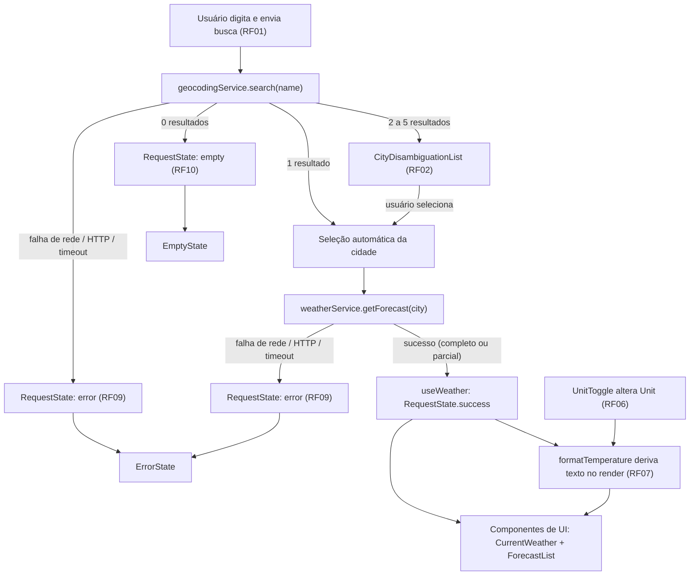

# Plano Técnico — Weather App

> Fonte da verdade: [specs/weather-app-spec.md](../specs/weather-app-spec.md).
> Este plano traduz a especificação em decisões técnicas, contratos de dados
> e estratégia de implementação. Não contém código de produção — apenas
> tipos/interfaces (contratos) e decisões arquiteturais.

## Architecture

Aplicação client-side (Single Page App), sem backend próprio. Todo dado vem
diretamente do Open-Meteo via chamadas HTTP feitas pelo navegador.

```text
┌─────────────────────────────────────────────────────────────┐
│                         Browser (SPA)                       │
│                                                               │
│  ┌───────────┐   ┌───────────────┐   ┌──────────────────┐   │
│  │Components │──▶│   Hooks (UI    │──▶│  Services         │   │
│  │(apresent.)│◀──│   state layer) │◀──│  (Open-Meteo API) │   │
│  └───────────┘   └──────┬────────┘   └──────────────────┘   │
│        │                │ usa                                │
│        ▼                ▼                                    │
│   Tailwind CSS      lib/ (funções puras: conversão, mapping)  │
└─────────────────────────────────────────────────────────────┘
                         │ HTTPS
                         ▼
                  Open-Meteo (Geocoding + Forecast)
```

Camadas (RF01–RF10, RNF04–RNF06) — ver justificativa detalhada em
[Project Structure](#project-structure):

1. **Components** (`src/components/`) — apresentação: busca, lista de
   desambiguação, clima atual, previsão de 5 dias, toggle de unidade,
   estados de loading/erro/vazio.
2. **Hooks** (`src/hooks/`) — orquestram busca de cidade, seleção, unidade de
   temperatura e ciclo de vida das requisições (loading/erro/cancelamento).
3. **Services** (`src/services/`) — acesso HTTP ao Open-Meteo, isolado dos
   componentes; única camada que conhece o formato bruto da API.
4. **Lib** (`src/lib/`) — funções puras e testáveis (conversão de
   temperatura, mapeamento de códigos meteorológicos), sem I/O.
5. **Types** (`src/types/`) — contratos compartilhados entre services, hooks
   e components.

Justificativa: a spec não exige backend, autenticação nem persistência
(Out of Scope), então uma SPA simples atende a todos os RF/NFR sem
infraestrutura adicional.

## Tech Stack

Stack já fixada pelo `.github/copilot-instructions.md` e pelo `package.json`
do repositório; este plano apenas mapeia cada tecnologia a um requisito.

| Tecnologia | Uso | Requisito relacionado |
| --- | --- | --- |
| React 19 + Vite | UI declarativa, build rápido, HMR | RNF05 (não bloquear interação) |
| TypeScript strict | Contratos tipados entre camadas | Precisão/testabilidade da spec |
| Tailwind CSS | Estilo responsivo, dark glassmorphism | RNF01, RNF10 (responsividade) |
| Vitest + Testing Library | Testes unitários de lib/services/hooks/components | Testing Strategy |
| Playwright | Testes E2E (Chromium desktop + iPhone 13) | RNF13 |
| Biome | Lint + format | Convenções do projeto |
| pnpm | Gerenciador de pacotes | Convenção do projeto |
| Open-Meteo (Geocoding + Forecast API) | Fonte de dados, sem API key | RF01–RF05, Data Requirements |

Não são adicionadas bibliotecas de state management (Redux/Zustand), roteador,
UI kit, ou cliente HTTP (axios/React Query): o escopo (uma única tela com
estados bem definidos) não justifica essa complexidade (princípio de
simplicidade).

**Orçamento de performance (RNF08 — conteúdo utilizável em até 3s em 4G
simulado):** nenhuma dependência de runtime além de `react`/`react-dom`;
sem code-splitting adicional (aplicação de tela única não justifica). O
tamanho do bundle de produção (`vite build`) deve ser observado como sinal de
regressão a cada release, mas nenhuma meta numérica de KB é fixada nesta
versão — ver gap registrado em [Plan Review](#plan-review).

## Project Structure

```text
src/
  components/
    SearchBar.tsx               # campo de busca + envio (RF01)
    CityDisambiguationList.tsx  # lista de até 5 opções (RF02)
    CurrentWeather.tsx          # clima atual (RF03)
    ForecastList.tsx            # previsão de 5 dias (RF04)
    ForecastDayCard.tsx         # um dia da previsão (RF05)
    UnitToggle.tsx              # alternância °C/°F (RF06, RF07)
    LoadingState.tsx            # indicador de carregamento (RF08)
    ErrorState.tsx              # mensagem de erro/timeout (RF09)
    EmptyState.tsx              # orientação inicial/sem resultados (RF10)
  hooks/
    useCitySearch.ts            # busca + desambiguação + cancelamento
    useWeather.ts                # clima atual + previsão da cidade selecionada
    useUnit.ts                   # estado da unidade de temperatura (Context)
  services/
    geocodingService.ts         # chamada à Geocoding API + normalização para City[]
    weatherService.ts           # chamada à Forecast API + normalização para WeatherData
  lib/
    temperature.ts               # conversão e arredondamento (função pura, Data Requirements)
    weatherCodeMap.ts           # mapeamento WMO → rótulo pt-BR (função pura)
  types/
    city.ts                     # City
    weather.ts                  # CurrentWeather, ForecastDay, WeatherData, Unit
    requestState.ts             # RequestState<T> (idle/loading/success/empty/error)
  App.tsx
  main.tsx
tests/
  unit/                          # Vitest + Testing Library (espelha src/)
  e2e/                            # Playwright (fluxos ponta a ponta)
```

Uma cidade selecionada por vez; sem roteamento (SPA de tela única atende a
todos os RF da spec).

### Por que essa separação facilita os testes

| Camada | Responsabilidade única | Como isso facilita o teste |
| --- | --- | --- |
| `components/` | Renderizar UI a partir de props; sem `fetch` direto | Testados com Testing Library usando apenas props/mocks de callback — nunca precisam de rede real (`testing.instructions.md`). |
| `hooks/` | Orquestrar chamadas a `services/`, expor `RequestState<T>` | Testados isolando o hook (`renderHook`) com `services/` mockado; nenhuma dependência de DOM. |
| `services/` | Único ponto que conhece o formato bruto da API e faz `fetch` | Testados com um único mock de `fetch`/`AbortController`, cobrindo sucesso, erro HTTP, timeout e resposta parcial sem subir um servidor real. |
| `lib/` | Funções puras (conversão, mapeamento) sem efeitos colaterais | Testadas como funções puras (`input → output`), sem mocks, execução instantânea — maior cobertura pelo menor esforço. |

Essa divisão segue diretamente `react.instructions.md` ("efeitos colaterais
ficam em hooks ou services, nunca inline no render") e o princípio de
"funções puras e testáveis" do `copilot-instructions.md`.

## Data Model

Tipos compartilhados (contratos), sem implementação. Campos baseados nos
dados retornados pela Open-Meteo (ver [External APIs](#external-apis)).

```ts
// src/types/city.ts
export interface City {
  id: number;              // id do resultado de geocodificação (Open-Meteo)
  name: string;            // nome da cidade
  admin1?: string;         // região/estado administrativo (quando disponível)
  country: string;         // nome do país
  countryCode?: string;    // código ISO do país (ex.: "BR")
  latitude: number;        // usada para consultar a previsão
  longitude: number;       // usada para consultar a previsão
  timezone: string;        // fuso horário IANA retornado pela API (ex.: "America/Sao_Paulo")
}

// src/types/weather.ts
export type Unit = 'celsius' | 'fahrenheit'; // unidade de exibição escolhida pelo usuário (RF06)

export interface CurrentWeather {
  temperatureC: number;    // temperatura atual em Celsius (fonte única de verdade, RF07)
  weatherCode: number;     // código de condição meteorológica bruto (WMO)
  observedAt: string;      // horário da leitura, ISO 8601, no fuso da cidade
  humidity: number | null; // umidade relativa em %; null = dado ausente
  windSpeed: number | null; // velocidade do vento em km/h; null = dado ausente
  precipitation: number | null; // precipitação em mm; null = dado ausente
  pressure: number | null; // pressão de superfície em hPa; null = dado ausente
}

export interface ForecastDay {
  date: string;                  // data do dia previsto, ISO 8601 (YYYY-MM-DD), fuso da cidade
  weatherCode: number | null;    // código WMO; null = dado ausente (RF05, resposta parcial)
  temperatureMaxC: number | null; // máxima em Celsius; null = dado ausente
  temperatureMinC: number | null; // mínima em Celsius; null = dado ausente
  precipitationProbability: number | null; // chance de precipitação em %; null = dado ausente
}

export interface WeatherData {
  city: City;                // cidade a que os dados pertencem
  current: CurrentWeather;   // clima atual (RF03)
  forecast: ForecastDay[];   // previsão diária; 5 entradas quando completa (RF04)
}

// src/types/requestState.ts
export type RequestState<T> =
  | { status: 'idle' }
  | { status: 'loading' }
  | { status: 'success'; data: T }
  | { status: 'empty' }                       // RF10: busca sem resultados
  | { status: 'error'; message: string; kind: 'network' | 'api' | 'timeout' | 'unknown' };
```

Temperaturas são sempre armazenadas em Celsius (unidade nativa do Open-Meteo);
a conversão para Fahrenheit e o arredondamento (round-half-away-from-zero,
ver Data Requirements da spec) ocorrem apenas na camada de apresentação, via
`lib/temperature.ts`, garantindo uma única fonte de verdade numérica — nunca
duplicada em estado (`react.instructions.md`: "derive estado sempre que
possível em vez de duplicá-lo").

```ts
// src/lib/temperature.ts (contrato — função pura, sem I/O)
export function celsiusToFahrenheit(celsius: number): number;

// Deriva o texto exibido a partir do valor em Celsius e da unidade ativa;
// retorna um rótulo de indisponibilidade quando temperatureC é null (RF05).
export function formatTemperature(temperatureC: number | null, unit: Unit): string;
```

```ts
// src/lib/weatherCodeMap.ts (contrato — função pura, sem I/O)
// Retorna o rótulo em pt-BR para um código WMO; códigos desconhecidos
// retornam undefined, tratado como dado ausente pelo chamador (RF05).
export function mapWeatherCodeToLabel(weatherCode: number | null): string | undefined;
```

## Data Flow

1. Usuário digita e envia a busca (RF01) → `useCitySearch` chama
   `geocodingService.search(name)`.
2. Serviço retorna até 5 `City` (Data Requirements) →
   `RequestState<City[]>` transita para `success`, `empty` (RF10) ou
   `error` (RF09).
3. Se houver 1 resultado, seleção automática; se houver 2+, o usuário escolhe
   na `CityDisambiguationList` (RF02).
4. Cidade selecionada → `useWeather` chama `weatherService.getForecast(city)`
   (clima atual + previsão em uma única chamada ao endpoint de forecast),
   com `AbortController` para cancelar buscas anteriores obsoletas
   (Edge Case: respostas fora de ordem).
5. Resposta é normalizada para `WeatherData` (via `weatherCodeMap` para
   códigos de condição) e armazenada em `RequestState<WeatherData>`.
6. `UnitToggle` altera apenas o estado local de `Unit`; nenhuma nova
   requisição é disparada (RF07) — `formatTemperature` recalcula o texto
   exibido na renderização a partir do valor em Celsius já armazenado.
7. Timeout de 10s (RNF12) é implementado com `AbortController` +
   `setTimeout`, resultando em `RequestState` com `kind: 'timeout'`.

### Diagrama de fluxo



## External APIs

Endpoints do Open-Meteo (sem API key, sempre via HTTPS — RNF04), conforme
Data Requirements da spec.

### Geocoding API

- **URL:** `https://geocoding-api.open-meteo.com/v1/search`
- **Parâmetros relevantes:** `name` (termo buscado), `count=5` (limite de
  resultados, Data Requirements), `language=pt`, `format=json`.
- **Uso:** RF01, RF02.

Exemplo resumido de resposta:

```json
{
  "results": [
    {
      "id": 3448439,
      "name": "São Paulo",
      "latitude": -23.5475,
      "longitude": -46.6361,
      "country": "Brazil",
      "country_code": "BR",
      "admin1": "São Paulo",
      "timezone": "America/Sao_Paulo"
    }
  ]
}
```

Ausência da chave `results` (ou array vazio) indica zero correspondências —
mapeado para `RequestState.empty` (RF10), nunca tratado como erro.

**Mapeamento para `City[]`:** cada item de `results` vira um `City`, campo a
campo (`id`, `name`, `admin1`, `country`, `country_code → countryCode`,
`latitude`, `longitude`, `timezone`); itens além do 6º resultado retornado
pela API (se o provedor ignorar `count`) são descartados no service.

### Forecast API

- **URL:** `https://api.open-meteo.com/v1/forecast`
- **Parâmetros relevantes:** `latitude`, `longitude` (da `City` selecionada),
  `current=temperature_2m,weather_code,relative_humidity_2m,wind_speed_10m,precipitation,surface_pressure`,
  `daily=weather_code,temperature_2m_max,temperature_2m_min,precipitation_probability_max`,
  `timezone=auto` (usa o fuso da própria localização — Edge Case de fuso
  horário), `forecast_days=5`.
- **Uso:** RF03, RF04, RF05.

Exemplo resumido de resposta:

```json
{
  "timezone": "America/Sao_Paulo",
  "current": {
    "time": "2026-09-02T14:00",
    "temperature_2m": 21.4,
    "weather_code": 3,
    "relative_humidity_2m": 68,
    "wind_speed_10m": 12.5,
    "precipitation": 0,
    "surface_pressure": 1017.2
  },
  "daily": {
    "time": ["2026-09-02", "2026-09-03", "2026-09-04", "2026-09-05", "2026-09-06"],
    "weather_code": [3, 61, 2, 1, 0],
    "temperature_2m_max": [24.1, 22.0, 25.3, 26.0, 27.1],
    "temperature_2m_min": [15.2, 14.8, 16.0, 16.5, 17.0],
    "precipitation_probability_max": [10, 75, 25, 5, 0]
  }
}
```

**Mapeamento para `WeatherData`:**
- `current` → `CurrentWeather { temperatureC: current.temperature_2m, weatherCode: current.weather_code, observedAt: current.time, humidity: current.relative_humidity_2m, windSpeed: current.wind_speed_10m, precipitation: current.precipitation, pressure: current.surface_pressure }`; métricas adicionais ausentes são normalizadas como `null`.
- `daily` → `ForecastDay[]`, combinando por índice `daily.time[i]`,
  `daily.weather_code[i]`, `daily.temperature_2m_max[i]`,
  `daily.temperature_2m_min[i]` e `daily.precipitation_probability_max[i]`;
  qualquer valor ausente/`null` em um índice é
  preservado como `null` no `ForecastDay` correspondente (RF05), nunca
  descartando o dia inteiro.
- Se `daily.time` tiver menos de 5 posições, o service retorna os dias
  disponíveis (Edge Case: resposta parcial) sem completar artificialmente a
  janela.

Contrato de erro tratado pelos services: qualquer resposta HTTP não-2xx ou
JSON com formato inesperado é convertido em `RequestState.error` (`kind:
'api'`) pelo service — nunca propaga exceção bruta ou detalhe HTTP para os
components, atendendo RF09 e RNF06.

## State Management

Sem biblioteca externa de state management. Estado local via hooks nativos
do React (`useState`, `useReducer`, `useEffect`) é suficiente porque:

- Existe uma única tela e uma única cidade selecionada por vez (Out of
  Scope: sem múltiplas telas, sem persistência entre sessões).
- Não há estado global compartilhado por múltiplos componentes distantes na
  árvore além de `Unit`, que pode ser passado via um único `React.Context`
  leve (`UnitContext`) para evitar prop drilling no toggle e nos displays de
  temperatura.

### Estados explícitos

Todo dado assíncrono (busca de cidade, clima/previsão) é representado pelo
mesmo `RequestState<T>` (ver Data Model), com exatamente 5 estados possíveis
e transições unidirecionais dentro de um ciclo de requisição:

```text
idle ──(usuário envia busca/seleciona cidade)──▶ loading
loading ──(resposta com dados)──────────────────▶ success
loading ──(resposta vazia)──────────────────────▶ empty
loading ──(falha de rede/API/timeout)───────────▶ error
success | empty | error ──(nova ação do usuário)▶ loading  (reinicia o ciclo)
```

Divisão de responsabilidade:

| Estado | Onde vive | Ciclo de vida |
| --- | --- | --- |
| Termo de busca e resultados de geocodificação | `useCitySearch` (`RequestState<City[]>`) | Reiniciado a cada nova busca |
| Cidade selecionada + clima/previsão | `useWeather` (`RequestState<WeatherData>`) | Reiniciado ao selecionar nova cidade |
| Unidade de temperatura (`Unit`) | `UnitContext` | Padrão `celsius`; não persiste entre sessões (Out of Scope) |

### Conversão Celsius/Fahrenheit sem novo request

`Unit` e os dados em Celsius (`WeatherData`) são estados independentes. A
troca de unidade **não** dispara nenhuma chamada a `services/`: os
componentes de exibição sempre leem o valor em Celsius já carregado e
chamam `formatTemperature(valorC, unit)` no corpo do render. Isso garante
(RF07): (a) atualização simultânea de clima atual e previsão, (b) mesmo
valor arredondado para a mesma temperatura em qualquer ponto da UI.

## Error Handling

Estratégia unificada via o tipo `RequestState<T>` (Data Model), consumido
pelos components de UI — cada `kind` de erro mapeia para uma causa distinta:

| `kind` | Causa | Exemplo |
| --- | --- | --- |
| `network` | `fetch` rejeita (sem conexão, DNS, CORS) | Dispositivo offline |
| `api` | Resposta HTTP não-2xx ou JSON com formato inesperado | Open-Meteo retorna 500 |
| `timeout` | Nenhuma resposta em 10s (RNF12) | API lenta/travada |
| `unknown` | Qualquer exceção não classificada acima | Erro de programação |

Mapeamento estado → componente:
- **loading** → `LoadingState` (RF08), exibido enquanto `status === 'loading'`.
- **empty** → `EmptyState` (RF10), para busca inicial sem cidade selecionada
  e para geocodificação sem resultados.
- **error** → `ErrorState` (RF09), com mensagem em pt-BR derivada de `kind`,
  nunca exibindo stack trace ou código HTTP bruto.
- **success** → conteúdo real (clima atual + previsão ou lista de
  desambiguação).

Regras específicas:
- Timeout de 10s (RNF12) implementado nos services com `AbortController`;
  hooks convertem o abort por timeout em `kind: 'timeout'`.
- Requisições obsoletas (busca nova antes da resposta da anterior) são
  canceladas via `AbortController` por chave de busca/cidade, evitando
  respostas fora de ordem.
- Dados parciais da previsão (campo ausente) **não** geram `error`; o
  `ForecastDay` mantém o dia com campos `null`, e o component exibe
  "indisponível" apenas no campo afetado (RF05) — distinção deliberada entre
  "falha ao buscar" (`error`) e "dado pontualmente ausente" (`null`).
- **Independência de cor (RNF03):** `LoadingState`, `EmptyState` e
  `ErrorState` sempre pareiam ícone/cor com texto explícito e usam roles
  ARIA adequados (`role="status"`/`role="alert"`); nenhum estado é
  comunicado apenas por cor.

## Testing Strategy

Alinhado a `testing.instructions.md` e ao Acceptance Criteria (Given/When/Then)
da spec — cada critério de aceite deve ser rastreável a um teste.

**Unitários (Vitest + Testing Library)** — `tests/unit/`:
- `lib/temperature.ts`: conversão e arredondamento (RF07), incluindo casos de
  fronteira (ex.: `.5`) — função pura, sem mocks.
- `lib/weatherCodeMap.ts`: cobertura de códigos conhecidos e de um código
  desconhecido (retorno `undefined` → tratado como indisponível, RF05).
- `services/`: mock de `fetch` cobrindo sucesso, lista vazia, erro HTTP,
  timeout e resposta parcial (RF09, RF05, Edge Cases); nunca chamam a API
  real (`testing.instructions.md`).
- `hooks/`: `useCitySearch`/`useWeather` com `services/` mockado —
  transições de `RequestState`, cancelamento de requisições obsoletas.
- `components/`: renderização de cada estado (`loading`/`empty`/`error`/
  `success`) via `getByRole`/`getByLabelText`, e alternância de unidade
  (RF06, RF07).

**E2E (Playwright)** — `tests/e2e/`, alvos definidos em RNF13 (Chromium
desktop + viewport iPhone 13), com `page.route` para respostas
determinísticas:
- Fluxo feliz: buscar cidade única → ver clima atual e previsão de 5 dias →
  trocar unidade.
- Desambiguação: buscar cidade homônima → selecionar uma opção → ver dados
  da cidade correta.
- Estado vazio: busca sem correspondência → mensagem orientativa.
- Erro: mock de falha de rede/timeout → mensagem de erro compreensível.
- Acessibilidade: navegação completa por teclado (Tab/Enter) nos fluxos
  acima (RNF02, RNF09).
- Responsividade: ao menos um teste no viewport mobile, sem rolagem
  horizontal em 320px (RNF10).

Cobertura de código não é definida como meta numérica nesta versão; o
critério de suficiência é 100% dos critérios de aceite (Given/When/Then) da
spec cobertos por pelo menos um teste automatizado.

## Risks & Trade-offs

| Decisão | Alternativa considerada | Por que foi descartada |
| --- | --- | --- |
| Sem biblioteca de state management | Redux/Zustand | Estado é local a poucos hooks; adicionaria complexidade sem ganho (Out of Scope: sem múltiplas telas). |
| `Context` só para `Unit` | Prop drilling manual | Context evita passar `unit`/`setUnit` por várias camadas de componentes de exibição, mantendo o restante do estado local. |
| Cancelamento via `AbortController` nativo | Biblioteca de data-fetching (React Query/SWR) | Reduz dependências; o padrão de requisições é simples (busca → seleção → forecast), sem necessidade de cache complexo ou revalidação em background. |
| Temperatura sempre armazenada em Celsius, convertida no render | Armazenar na unidade exibida | Evita perda de precisão por conversões repetidas e garante fonte única de verdade (RF07). |
| Timeout de 10s implementado no cliente (RNF12) | Confiar apenas no timeout padrão do navegador | Timeout do navegador é muito longo/variável; um limite explícito é necessário para cumprir RNF12 de forma testável. |
| Mapeamento de códigos WMO em `lib/weatherCodeMap.ts` (função pura) | Inline nos components, ou dentro de `services/` | Isola conhecimento de domínio, facilita teste unitário direto sem mocks e evita duplicação entre `CurrentWeather` e `ForecastDayCard`. |
| Sem cache/deduplicação de requisições | Cache local com TTL | Fora do escopo desta versão (mitigação de rate limit fica para uma iteração futura, se necessário); simplicidade preferida no MVP; busca é disparada só por submit (sem debounce necessário). |
| Sem meta numérica de bundle size (RNF08) | Definir orçamento de KB e falhar o CI acima do limite | Adiado por simplicidade nesta versão; ausência de dependências pesadas já reduz o risco — registrado como gap em [Plan Review](#plan-review). |

Riscos técnicos herdados da spec e como o plano os endereça:

- **Indisponibilidade/timeout do Open-Meteo** → tratado via `RequestState`
  + timeout de 10s no service (RF09, RNF12).
- **Códigos meteorológicos sem mapeamento** → tratado centralizadamente em
  `lib/weatherCodeMap.ts`, retornando `undefined`/rótulo "indisponível" (RF05).
- **Respostas fora de ordem** → `AbortController` por requisição ativa nos
  hooks de busca e de clima.
- **Acessibilidade insuficiente** → responsabilidade explícita de cada
  component de estado (`LoadingState`, `ErrorState`, `EmptyState`) usar
  roles/ARIA adequados e nunca depender só de cor (RNF03), validado por
  testes unitários e E2E de teclado.

## Plan Review

Autoavaliação deste plano contra `specs/weather-app-spec.md` e
`.github/copilot-instructions.md`.

### Cobertura de requisitos

| Requisito | Coberto por | Status |
| --- | --- | --- |
| RF01–RF10 | Data Flow, Data Model, State Management, Error Handling | ✅ Completo |
| RNF01, RNF10 (responsivo, sem scroll horizontal) | Tailwind (`tailwind.instructions.md`), Testing Strategy (E2E responsividade) | ✅ Completo |
| RNF02, RNF09 (teclado, WCAG AA) | Error Handling (roles ARIA), Testing Strategy (E2E teclado) | ⚠️ Coberto em princípio; falta checklist de acessibilidade por componente (ver Gaps) |
| RNF03 (não depender só de cor) | Error Handling — regra explícita adicionada nesta revisão | ✅ Completo (gap corrigido) |
| RNF04 (HTTPS) | External APIs (URLs sempre `https://`) | ✅ Completo |
| RNF05 (não bloquear interação) | Tech Stack (fetch assíncrono, sem dependências pesadas) | ✅ Completo |
| RNF06 (resiliência) | Error Handling (kinds `network`/`api`/`timeout`/`unknown`) | ✅ Completo |
| RNF07 (pt-BR) | `lib/weatherCodeMap.ts`, mensagens de erro em pt-BR | ✅ Completo |
| RNF08 (3s em 4G) | Tech Stack (orçamento de performance) | ⚠️ Parcial — sem meta numérica de bundle size (ver Gaps) |
| RNF11 (disponibilidade 99,5%) | — | Fora do escopo deste plano (spec marca como decisão operacional/infra, não bloqueante) |
| RNF12 (timeout 10s) | Data Flow passo 7, Error Handling | ✅ Completo |
| RNF13 (navegadores/viewports) | Tech Stack, Testing Strategy | ✅ Completo |

### Gaps identificados (e como foram tratados)

1. **RNF03** — o plano original não deixava explícita a regra de não
  depender de cor; corrigido nesta revisão em Error Handling.
2. **RNF08** — não há meta numérica de tamanho de bundle nem verificação
  automatizada de performance; documentado como trade-off aceito no MVP
  (Risks & Trade-offs). Recomenda-se decidir um orçamento de KB no momento
  do Task planning, se a equipe julgar necessário.
3. **RNF02/RNF09** — a estratégia cobre acessibilidade em nível de decisão
  (roles ARIA, navegação por teclado testada), mas não define um checklist
  específico por componente; fica para a fase de Tasks detalhar rótulos
  exatos (`aria-label`, ordem de foco) por elemento.

### Over-engineering: não identificado

Sem Redux/Zustand, sem roteador, sem cliente HTTP externo, sem cache — todas
as decisões usam apenas a stack já fixada no `package.json` e recursos
nativos do React/`fetch`. O único acréscimo de abstração (`Context` para
`Unit`) é justificado por evitar prop drilling em múltiplos componentes de
exibição.

### Contradições com `.github/copilot-instructions.md`: nenhuma encontrada

O plano segue as convenções declaradas: componentes um por arquivo em
`src/components/`, acesso a dados isolado em `src/services/`, hooks em
`src/hooks/`, tipos compartilhados em `src/types/`, estados de
loading/erro/vazio tratados explicitamente, e acessibilidade considerada em
todos os componentes de estado. A única adição não mencionada literalmente
nas instruções do projeto é a pasta `src/lib/` para funções puras — não é
uma contradição, mas uma extensão alinhada ao princípio "funções puras e
testáveis; evite efeitos colaterais escondidos" já presente nas instruções.
